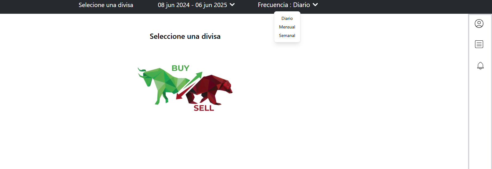
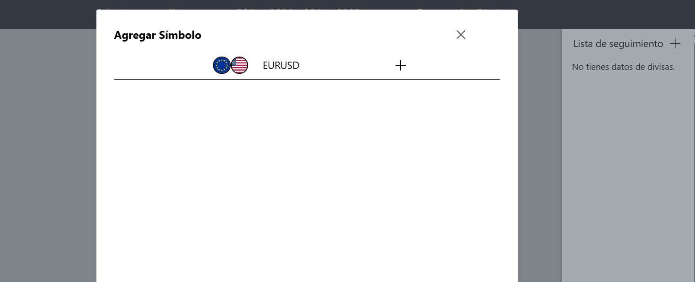
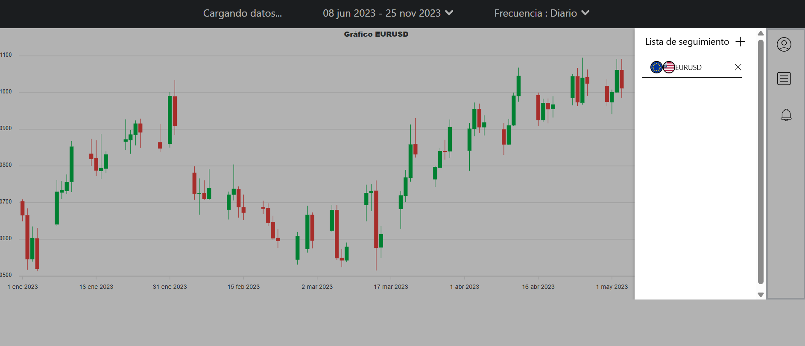
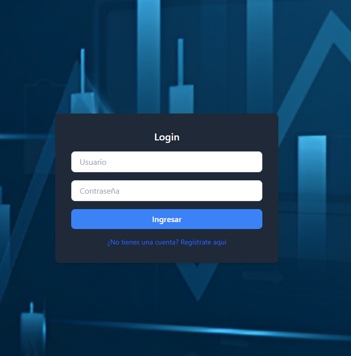
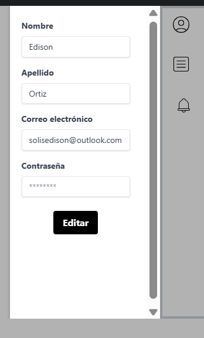

# 📊 ForexRadar Frontend

<div align="center">


**Modern React application for real-time Forex data visualization and trading analysis**

[🚀 Live Demo](#-screenshots) • [📖 Documentation](#-key-features) • [⚡ Quick Start](#️-quick-installation) • [🔗 Backend API](https://github.com/Dionisio202/ForexRadar-backend)

</div>

---

## 🎯 About ForexRadar Frontend

**ForexRadar Frontend** is a cutting-edge React application built with **TypeScript**, **Vite**, and **TailwindCSS** that provides real-time Forex market analysis and visualization. It features interactive candlestick charts, real-time price tracking, and personalized watchlist management for traders and financial analysts.

This frontend seamlessly integrates with the [ForexRadar Backend](https://github.com/Dionisio202/ForexRadar-backend) to deliver comprehensive market data through advanced scraping and API integration.

---

## ✨ Key Features

<table>
<tr>
<td width="50%">

### 📈 **Market Analysis**
- 🕯️ Interactive candlestick charts with ApexCharts
- ⏱️ Real-time price updates (auto-refresh every 10s)
- 📊 Multiple timeframes (Daily, Weekly, Monthly)
- 🎯 Custom date range selection

</td>
<td width="50%">

### 👤 **User Management**
- 🔐 Secure authentication system
- 📝 User registration and login
- ⭐ Personalized watchlist management
- 👤 Profile customization (name, password)

</td>
</tr>
</table>

---

## 🖼️ Screenshots

<table>
  <tr>
    <td colspan="4" align="center">

    ### 📋 **HOME**  
    

    </td>
  </tr>

  <tr>
    <td width="25%" align="center">

    ### 👤 **Add Symbol**  
    

    </td>

    <td width="25%" align="center">

    ### 🏠 **Candlestick Chart**  
    

    </td>

    <td width="25%" align="center">

    ### 🔐 **Login Interface**  
    

    </td>

    <td width="25%" align="center">

    ### ➕ **Profile Management**  
    

    </td>
  </tr>
</table>

---

## 🛠️ Tech Stack

### 🔧 **Core Technologies**
```typescript
React 18.2.0           // Modern UI library
TypeScript 5.0+        // Type-safe development
Vite 5.0               // Ultra-fast build tool
TailwindCSS 3.3        // Utility-first CSS framework
```

### 📊 **Data & Visualization**
```typescript
ApexCharts 3.44        // Interactive financial charts
Axios                  // HTTP client for API calls
Supabase JS SDK        // Database & authentication
```

### ⚡ **Development Tools**
```typescript
ESLint                 // Code linting
Prettier               // Code formatting
TypeScript ESLint      // TypeScript-specific linting
```

---

## 📁 Project Structure

```
src/
├── 🔀 router/                    # Functional components
│   ├── 📊 currentData.tsx        # Real-time price display
│   ├── 📈 ForexChart.tsx         # Candlestick chart component
│   ├── ➕ add-Divisa.tsx         # Add currency modal
│   ├── 🗑️ delete-Divisa.tsx      # Remove currency from watchlist
│   ├── 👤 profile-edit.tsx       # Profile management
│   ├── 🔔 alarmModal.tsx         # General modal component
│   ├── 📝 form.tsx               # Date & frequency controls
│   ├── 🔐 login.tsx              # Login screen
│   ├── 📝 register.tsx           # User registration
│   └── 🔌 methods.tsx            # API connection logic (Axios)
├── 🎨 assets/                    # Images, icons, static files
├── 📱 App.tsx                    # Main application structure
├── 🌐 globalProvider.tsx         # Global state management
├── 🎨 index.css                  # Base styles
└── 📄 index.html                 # HTML template
```

---

## 🚀 Quick Installation

### 📋 Prerequisites

- **Node.js** ≥ 18.0.0
- **npm** or **yarn**
- **ForexRadar Backend** running on `http://127.0.0.1:8000`

> 🔗 **Backend Setup:** [ForexRadar-backend](https://github.com/Dionisio202/ForexRadar-backend)

### ⚡ Installation Steps

```bash
# 1️⃣ Clone the repository
git clone https://github.com/Dionisio202/ForexRadar-frontEnd.git
cd ForexRadar-frontEnd

# 2️⃣ Install dependencies
npm install
# or
yarn install

# 3️⃣ Configure backend URL (if needed)
# Edit methods.tsx to match your backend URL

# 4️⃣ Start development server
npm run dev
# or
yarn dev

# 5️⃣ Open in browser
# http://localhost:5173
```

### 🎯 Quick Access Links
- **Development Server:** `http://localhost:5173`
- **Backend API:** `http://127.0.0.1:8000`
- **Admin Panel:** `http://127.0.0.1:8000/admin`

---

## 🔧 Core Functionalities

### 🔐 **Authentication System**

<table>
<tr>
<td width="50%">

**Components:**
- `login.tsx` - User authentication
- `register.tsx` - New user registration

</td>
<td width="50%">

**Features:**
- Secure token-based authentication
- Local storage for session management
- User profile management

</td>
</tr>
</table>

### 📊 **Real-Time Market Data**

<table>
<tr>
<td width="50%">

**Components:**
- `currentData.tsx` - Live price display
- `ForexChart.tsx` - Interactive charts

</td>
<td width="50%">

**Features:**
- Auto-refresh every 10 seconds
- Multiple timeframe support
- Historical data visualization

</td>
</tr>
</table>

### ⭐ **Watchlist Management**

<table>
<tr>
<td width="50%">

**Components:**
- `add-Divisa.tsx` - Add currencies
- `delete-Divisa.tsx` - Remove currencies

</td>
<td width="50%">

**Features:**
- Personalized currency tracking
- Quick add/remove functionality
- User-specific storage

</td>
</tr>
</table>

---

## 📡 API Integration

### 🔌 **Consumed Endpoints**

| Endpoint | Method | Description | Component |
|----------|--------|-------------|-----------|
| `/user/register/` | `POST` | User registration | `register.tsx` |
| `/user/login/` | `POST` | User authentication | `login.tsx` |
| `/user/getProfile/` | `POST` | Get user profile | `profile-edit.tsx` |
| `/user/updateProfileName/` | `PUT` | Update profile name | `profile-edit.tsx` |
| `/user/changePassword/` | `POST` | Change password | `profile-edit.tsx` |
| `/divisa/currentData/` | `GET` | Real-time prices | `currentData.tsx` |
| `/divisa/tableData/` | `GET` | Historical data | `ForexChart.tsx` |
| `/divisa/divisaInformation/` | `GET` | Available currencies | `add-Divisa.tsx` |
| `/divisa/insertarDivisaInformation/` | `POST` | Add to watchlist | `add-Divisa.tsx` |
| `/divisa/obtenerDivisas/` | `GET` | Get user watchlist | `methods.tsx` |
| `/divisa/eliminarDivisas/` | `GET` | Remove from watchlist | `delete-Divisa.tsx` |

---

## 🎨 Design Features

### 🌟 **Modern UI/UX**
- **Responsive Design** → Mobile-first approach with TailwindCSS
- **Dark/Light Theme** → Consistent color scheme
- **Interactive Charts** → Smooth animations and hover effects
- **Modal System** → Clean popup interfaces

### 📱 **Mobile Optimization**
- **Touch-friendly** → Optimized for mobile trading
- **Fast Loading** → Vite's optimized build system
- **Offline Ready** → Service worker integration

---

## ⚙️ Configuration

### 🔧 **Environment Setup**

Create a `.env` file in the root directory:

```env
VITE_API_BASE_URL=http://127.0.0.1:8000
VITE_SUPABASE_URL=your_supabase_url
VITE_SUPABASE_ANON_KEY=your_supabase_key
```

### 🎯 **Build Configuration**

```json
{
  "scripts": {
    "dev": "vite",
    "build": "tsc && vite build",
    "preview": "vite preview",
    "lint": "eslint . --ext ts,tsx --report-unused-disable-directives --max-warnings 0"
  }
}
```

---

## 🚀 Production Deployment

### 📦 **Build for Production**

```bash
# Build optimized bundle
npm run build

# Preview production build
npm run preview
```

### 🌐 **Deployment Options**

- **Vercel** → `vercel --prod`
- **Netlify** → Drag & drop `dist` folder
- **GitHub Pages** → Actions workflow
- **Docker** → Containerized deployment

---

## 🧪 Testing & Quality

### 🔍 **Code Quality**
```bash
# Run linting
npm run lint

# Type checking
npx tsc --noEmit

# Format code
npx prettier --write .
```

### 📊 **Performance Monitoring**
- **Bundle Analysis** → `npm run build --analyze`
- **Lighthouse** → Built-in performance metrics
- **Web Vitals** → Core performance indicators

---

## 🗺️ Roadmap

### 🎯 **Upcoming Features**

- [ ] **📊 Advanced Analytics Dashboard** → KPIs, volume analysis
- [ ] **🔔 Price Alerts System** → Real-time notifications
- [ ] **🤖 AI-Powered Predictions** → Machine learning integration
- [ ] **📱 Mobile App** → React Native version
- [ ] **🎨 Theming System** → Multiple color schemes
- [ ] **📈 Technical Indicators** → RSI, MACD, Bollinger Bands
- [ ] **💼 Portfolio Management** → Trade tracking


### 🔄 **Current Sprint**
- [ ] Enhanced error handling
- [ ] Loading state improvements
- [ ] Chart performance optimization

---

## 🐛 Known Issues & Solutions

### ⚠️ **Common Problems**

| Issue | Solution |
|-------|----------|
| **Charts not loading** | Ensure backend is running on port 8000 |
| **Authentication errors** | Clear localStorage and re-login |
| **Slow chart rendering** | Reduce data points or timeframe |
| **CORS errors** | Configure backend CORS settings |

---

## 🤝 Contributing

We welcome contributions! Here's how you can help:

### 📝 **How to Contribute**

1. **🍴 Fork** the repository
2. **🌿 Create** a feature branch (`git checkout -b feature/AmazingFeature`)
3. **💾 Commit** your changes (`git commit -m 'Add some AmazingFeature'`)
4. **🚀 Push** to the branch (`git push origin feature/AmazingFeature`)
5. **🔄 Open** a Pull Request


## 🔗 Related Projects

<table>
<tr>
<td width="50%">

### 🔗 **Project Links**
- 🚀 **Backend API:** [ForexRadar-backend](https://github.com/Dionisio202/ForexRadar-backend)
- 📱 **Frontend App:** [ForexRadar-frontEnd](https://github.com/Dionisio202/ForexRadar-frontEnd)

</td>
<td width="50%">

### 📚 **Documentation**
- 📖 **React Docs:** [react.dev](https://react.dev/)
- 🎨 **TailwindCSS:** [tailwindcss.com](https://tailwindcss.com/)
- 📊 **ApexCharts:** [apexcharts.com](https://apexcharts.com/)

</td>
</tr>
</table>

---


---

<div align="center">

**⭐ If you find this project helpful, please consider giving it a star on GitHub! ⭐**

*Built with ❤️ by [Dionisio202](https://github.com/Dionisio202)*


</div>